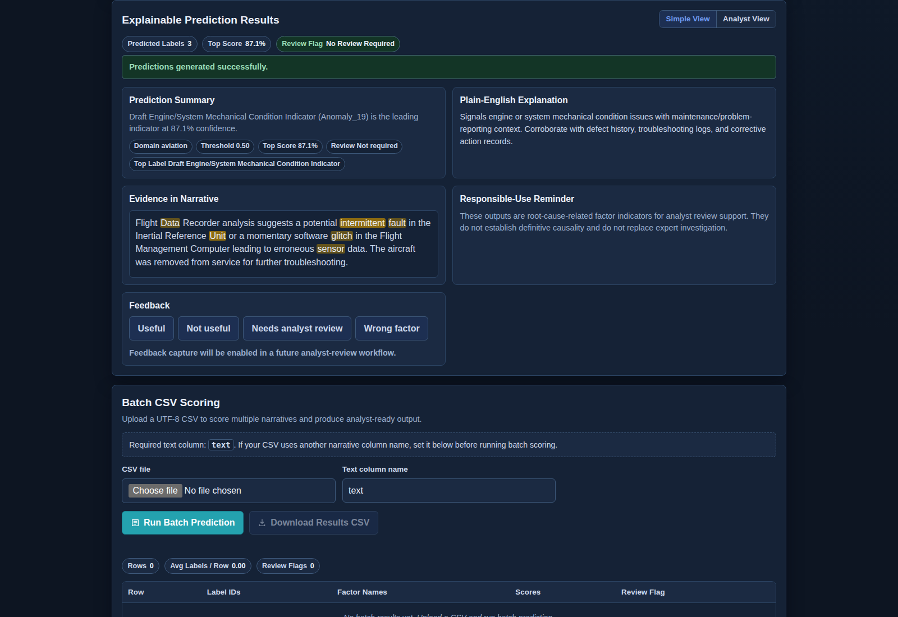
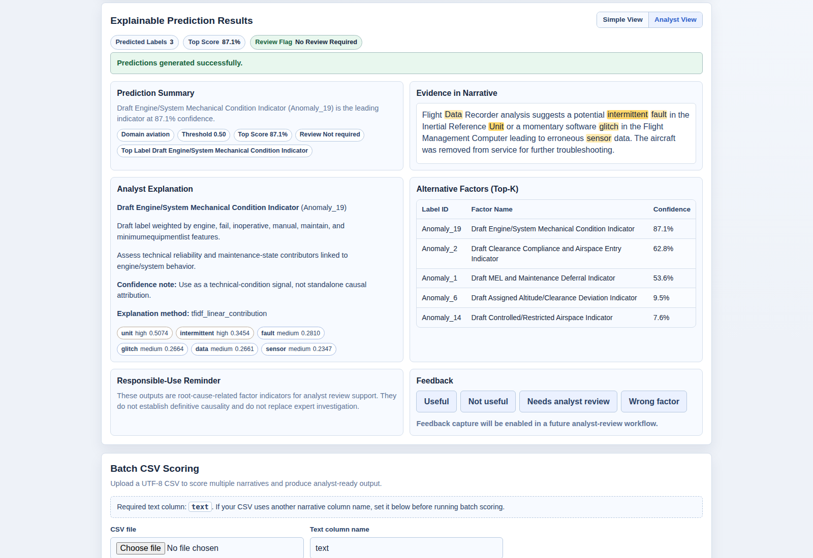
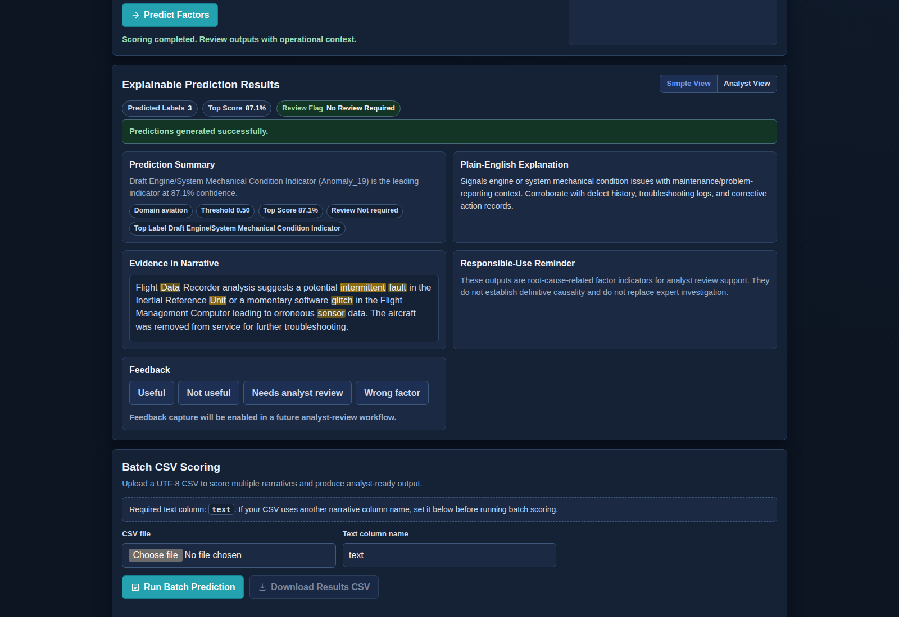

# Operations Root Cause Analytics with NLP

**Natural Language Processing for Incident Narrative Analysis and Root-Cause-Related Factor Classification**

An applied operations-intelligence NLP system that turns free-text incident narratives into explainable factor indicators for analyst review, batch scoring, and decision-support workflows.

Short name: **Operations RCA NLP**  
Repository: **operations-root-cause-analytics-nlp**

## Live Demo and Project Links

| Resource | Link |
|---|---|
| Live demo | [Operations RCA NLP Demo](https://operations-root-cause-analytics-nlp.onrender.com/) |
| Architecture notes | [docs/architecture.md](docs/architecture.md) |
| Explainability method | [docs/explainability.md](docs/explainability.md) |
| Aviation model card | [docs/model_card_aviation.md](docs/model_card_aviation.md) |
| Visual assets guide | [docs/visuals.md](docs/visuals.md) |
| v0.3.0 model plan | [docs/model_performance_plan_v0.3.0.md](docs/model_performance_plan_v0.3.0.md) |

> The live demo supports root-cause-related factor classification for analyst review. It does not establish definitive causality or replace expert investigation.

> The live demo loads the trained aviation model artifact from Hugging Face using `MODEL_ARTIFACT_URL`, keeping the GitHub repository lightweight and free from model binaries.

## Demo Preview


The interface supports light and dark themes for readability during analysis workflows.

| Explainable Prediction | Analyst View |
|---|---|
|  |  |

Additional screenshots and refresh instructions are documented in [docs/visuals.md](docs/visuals.md).

## Why This Project Matters

Operational teams often rely on free-text incident narratives: safety reports, maintenance notes, disruption records, near-miss logs, and analyst comments. These records contain useful contributory-factor signals, but manual review is slow, inconsistent, and difficult to scale.

Operations RCA NLP shows how a practical analytics system can convert narrative text into structured, reviewable outputs:

- faster triage for incident queues
- confidence-ranked factor indicators for analyst review
- batch scoring for larger report sets
- transparent evidence cues for model interpretation
- dashboard-ready outputs for operations intelligence workflows

ASRS aviation reports are the first demonstration domain. The design is not aviation-only: the domain registry, metadata pattern, and artifact structure are intended to support future operations domains such as maintenance work orders, asset failure narratives, service disruptions, and near-miss reports.

The motivation is grounded in real operational practice: ASRS shows the scale and value of narrative safety reporting, incident-investigation guidance emphasizes understanding contributing factors before recurrence prevention, and AI risk-management guidance emphasizes human oversight when model outputs support decisions. References are listed at the end of this README.

## System Architecture


The app is a lightweight FastAPI system with a static analyst UI. The model artifact is intentionally kept out of GitHub and loaded from external storage in deployment.

## End-to-End Workflow


```text
Incident narrative
-> preprocessing / TF-IDF vectorization
-> One-vs-Rest Logistic Regression
-> confidence scores and threshold filtering
-> evidence-term contribution scoring
-> Simple View / Analyst View / batch CSV output
-> analyst review support
```

## Key Features

| Feature | Practical value |
|---|---|
| Single narrative scoring | Lets an analyst score one incident report and review factor indicators immediately. |
| Batch CSV scoring | Processes multiple narratives into structured outputs for reporting or downstream analytics. |
| Confidence-aware predictions | Uses scores and thresholds to support triage decisions and review prioritization. |
| Human-readable factor names | Converts raw `Anomaly_*` model labels into draft working labels for easier interpretation. |
| Explainability cues | Shows evidence terms and highlighted narrative spans so users can inspect why a label was suggested. |
| Simple View and Analyst View | Supports both non-technical review and technical model inspection. |
| External artifact loading | Keeps `model.joblib` out of GitHub while allowing Render to load the trained model through `MODEL_ARTIFACT_URL`. |
| Multi-domain-ready structure | Uses domain configs, label registries, and metadata files to support future operational domains. |

## Methodology

### Data and Domain

- First demonstration domain: aviation incident narratives from a local frozen NASA ASRS/SIAM 2007 benchmark snapshot.
- Public repository policy: raw narratives and source data are not committed.
- Label space: `Anomaly_1` through `Anomaly_22`, surfaced through a draft human-readable label registry.

### Model

The current deployed baseline is intentionally interpretable:

- **Vectorizer**: TF-IDF
  - `ngram_range=(1, 2)`
  - `max_features=30000`
  - `min_df=2`
  - `strip_accents="unicode"`
  - `sublinear_tf=True`
- **Classifier**: One-vs-Rest Logistic Regression
  - `C=2.0`
  - `max_iter=400`
  - `class_weight="balanced"`
  - `solver="liblinear"`
  - `random_state=42`
- **Threshold**: `0.50`

This approach is fast, deployable, and transparent enough for coefficient-based explanations. It is a strong baseline before heavier transformer or retrieval-based methods are introduced.

### Evaluation

The v0.2.0 live artifact is trained on the full local aviation dataset snapshot and hosted externally on Hugging Face. Current aggregate metrics:

| Metric | Value | Interpretation |
|---|---:|---|
| Micro-F1 | 0.7175 | Overall label-level precision/recall balance across all predictions. |
| Macro-F1 | 0.6414 | Average label performance; lower than micro-F1, indicating weaker minority-label behavior. |
| Samples-F1 | 0.7194 | Per-sample multi-label prediction quality. |
| Hamming loss | 0.0620 | Per-label error rate; lower is better. |


These metrics are useful for baseline comparison, not proof of operational readiness. v0.3.0 focuses on per-label metrics, weakest-label analysis, threshold tuning, calibration checks, and error analysis.

## Explainability and Decision Support

The model uses a linear explanation method:

```text
contribution = TF-IDF value x logistic regression coefficient
```

For each predicted label, the system ranks positive feature contributions, maps evidence terms back to the original narrative where possible, and highlights those spans in the UI.



How to interpret outputs:

- Treat predictions as root-cause-related factor indicators.
- Use confidence scores and review flags as triage support.
- Inspect evidence terms and highlighted text before accepting a result.
- Keep raw `Anomaly_*` IDs for technical traceability.
- Do not treat outputs as causal proof or automated investigation findings.

Detailed explanation notes: [docs/explainability.md](docs/explainability.md)

## API Overview

| Endpoint | Purpose |
|---|---|
| `GET /health` | Service health and active app metadata |
| `GET /domains` | Implemented and planned domain registry |
| `GET /model-info` | Model metadata, metrics, threshold, and artifact status |
| `POST /predict` | Single narrative prediction with explanations |
| `POST /predict-batch` | CSV batch scoring |

Example request:

```bash
curl -X POST "http://127.0.0.1:8000/predict" \
  -H "Content-Type: application/json" \
  -d '{
    "text": "Crew received conflicting altitude and approach clearance instructions during descent.",
    "domain": "aviation",
    "threshold": 0.5,
    "top_k": 5
  }'
```

Example response shape:

```json
{
  "status": "ok",
  "domain": "aviation",
  "summary": {
    "predicted_count": 2,
    "top_label_id": "Anomaly_2",
    "top_label_name": "Draft Assigned Altitude/Clearance Deviation Indicator",
    "top_score": 0.81,
    "review_flag": false
  },
  "predicted_labels": [
    {
      "label_id": "Anomaly_2",
      "label_name": "Draft Assigned Altitude/Clearance Deviation Indicator",
      "score": 0.81,
      "plain_language_description": "Signals potential deviation from assigned altitude or clearance execution.",
      "evidence_terms": [
        {
          "term": "altitude",
          "contribution": 0.2145,
          "importance": "high"
        }
      ],
      "evidence_spans": [
        {
          "term": "altitude",
          "start": 24,
          "end": 32,
          "importance": "high"
        }
      ]
    }
  ],
  "message": "Predictions generated successfully."
}
```

## Repository Structure

```text
operations-root-cause-analytics-nlp/
  app/
    api/              FastAPI routes and dependency wiring
    domains/          domain configs, label registry, metadata templates
    schemas/          typed request/response models
    services/         model loading, prediction, batch scoring, explainability
    ui/               lightweight HTML/CSS/JS analyst interface
  artifacts/          local artifact metadata/examples; model binaries ignored
  docs/               architecture, model card, roadmap, visuals, responsible use
  sample_inputs/      safe sample CSV inputs
  scripts/            training, evaluation, artifact export, visual generation
  tests/              pytest suite
  Dockerfile
  render.yaml
  README.md
```

## Local Setup

```bash
git clone https://github.com/nana-kwame-safo/operations-root-cause-analytics-nlp.git
cd operations-root-cause-analytics-nlp

python3 -m venv .venv
source .venv/bin/activate
pip install -r requirements.txt

uvicorn app.main:app --reload
```

Open:

```text
http://127.0.0.1:8000
```

Run tests:

```bash
pytest -q
```

## Artifact Generation

The public repo does not include raw data or `model.joblib`. Generate artifacts locally from your permitted dataset copy.

Single CSV workflow:

```bash
python scripts/train_aviation.py \
  --input-csv <local_labeled_data.csv> \
  --text-column text \
  --output-dir artifacts/aviation
```

Split-file workflow:

```bash
python scripts/export_aviation_artifacts.py \
  --train-text data/raw/TrainingData.txt \
  --train-labels data/raw/TrainCategoryMatrix.csv \
  --output-dir artifacts/aviation
```

Evaluate an artifact:

```bash
python scripts/evaluate_aviation.py \
  --input-csv <local_labeled_data.csv> \
  --text-column text \
  --artifact-path artifacts/aviation/model.joblib
```

Expected runtime files:

- `artifacts/aviation/model.joblib`
- `artifacts/aviation/metadata.json`
- `artifacts/aviation/label_mapping.json`

## Deployment and Artifact Handling

The live app is deployed on Render:

```text
https://operations-root-cause-analytics-nlp.onrender.com/
```

Render configuration:

```text
Build Command: pip install -r requirements.txt
Start Command: uvicorn app.main:app --host 0.0.0.0 --port $PORT
PYTHON_VERSION=3.11.9
MODEL_ARTIFACT_URL=<direct HTTPS URL to model.joblib>
MODEL_ARTIFACT_PATH=artifacts/aviation/model.joblib
```

Artifact policy:

- `model.joblib` is hosted externally on Hugging Face and loaded with `MODEL_ARTIFACT_URL`.
- `model.joblib` is not committed to GitHub.
- raw data under `data/raw/`, `data/interim/`, and `data/processed/` is excluded.
- CI tests intentionally run without the real model artifact and validate graceful missing-artifact behavior.

Docker:

```bash
docker build -t operations-root-cause-analytics-nlp .
docker run -p 8000:8000 operations-root-cause-analytics-nlp
```

## Limitations

- The aviation label names are draft working labels derived from model features and require domain review.
- Metrics are aggregate baseline metrics; v0.3.0 will add per-label and calibration analysis.
- TF-IDF models are sensitive to vocabulary shift and reporting-style variation.
- Evidence highlights explain model behavior, not causal truth.
- New operational domains require domain-specific labels, validation, and retraining.
- This is not a certified safety-critical decision system.

## Roadmap

| Release | Focus |
|---|---|
| `v0.1.0` | ASRS text-based MVP with FastAPI, UI, single prediction, and batch scoring |
| `v0.2.0` | Explainable analyst interface with label registry, evidence highlighting, and richer API schema |
| `v0.3.0` | Model performance improvement: per-label metrics, threshold tuning, calibration, weakest-label analysis |
| `v0.4.0` | Transformer and sentence-transformer baselines with explainability comparison |
| `v0.5.0` | Similar-case retrieval, weak supervision, and analyst feedback loop |
| `v0.6.0` | Multimodal-ready and agentic analyst-support workflows |

See [docs/roadmap.md](docs/roadmap.md) and [docs/model_roadmap.md](docs/model_roadmap.md).

## Skills Demonstrated

- Python application engineering
- FastAPI API design
- NLP preprocessing and TF-IDF modeling
- Multi-label classification
- Logistic Regression and threshold-based prediction
- Model evaluation and model-card documentation
- Explainability for linear text models
- Lightweight frontend development with HTML/CSS/JS
- Docker and Render deployment
- External model artifact handling
- Responsible AI documentation
- Operations analytics and decision-support framing

## Responsible Use

Operations RCA NLP is a decision-support prototype. It supports analyst review by surfacing factor indicators, confidence scores, and evidence cues. It should not be used blindly for high-stakes decisions, and it does not replace expert investigation, domain review, or operational governance.

## License

This project is released under the [MIT License](LICENSE).

## References

1. NASA. *Aviation Safety Reporting System (ASRS) Overview*.  
   https://www.nasa.gov/human-systems-integration-division/aviation-safety-reporting-system-overview/
2. NASA ASRS. *Database Overview*.  
   https://asrs.arc.nasa.gov/search/database.html
3. OSHA. *Incident Investigation*.  
   https://www.osha.gov/incident-investigation
4. FAA. *Safety Management System (SMS) Components*.  
   https://www.faa.gov/about/initiatives/sms/explained/components
5. NIST. *AI Risk Management Framework (AI RMF 1.0)*.  
   https://nvlpubs.nist.gov/nistpubs/ai/nist.ai.100-1.pdf
