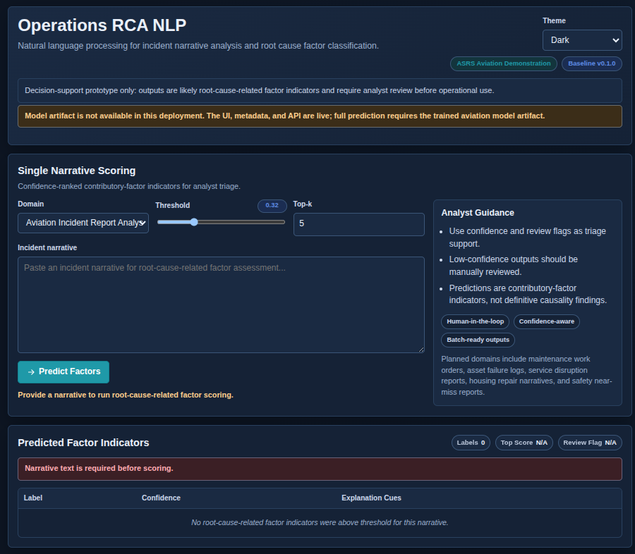
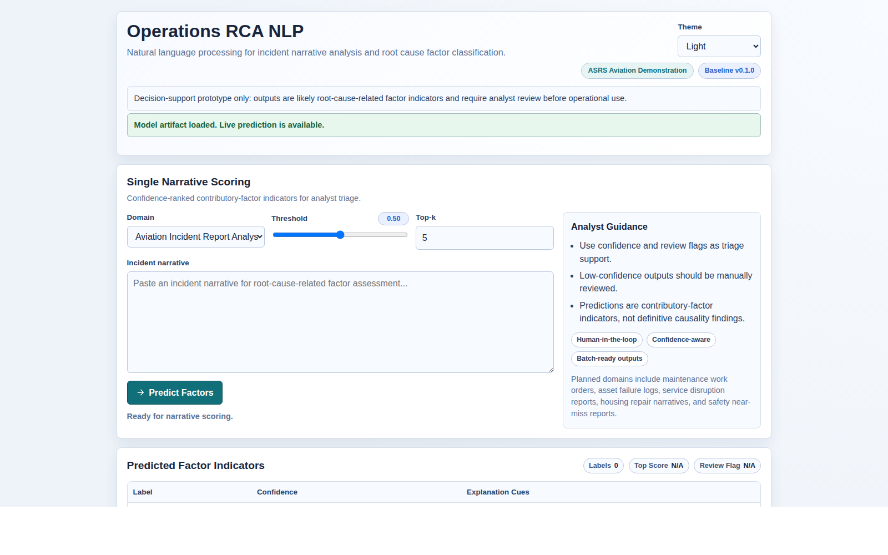
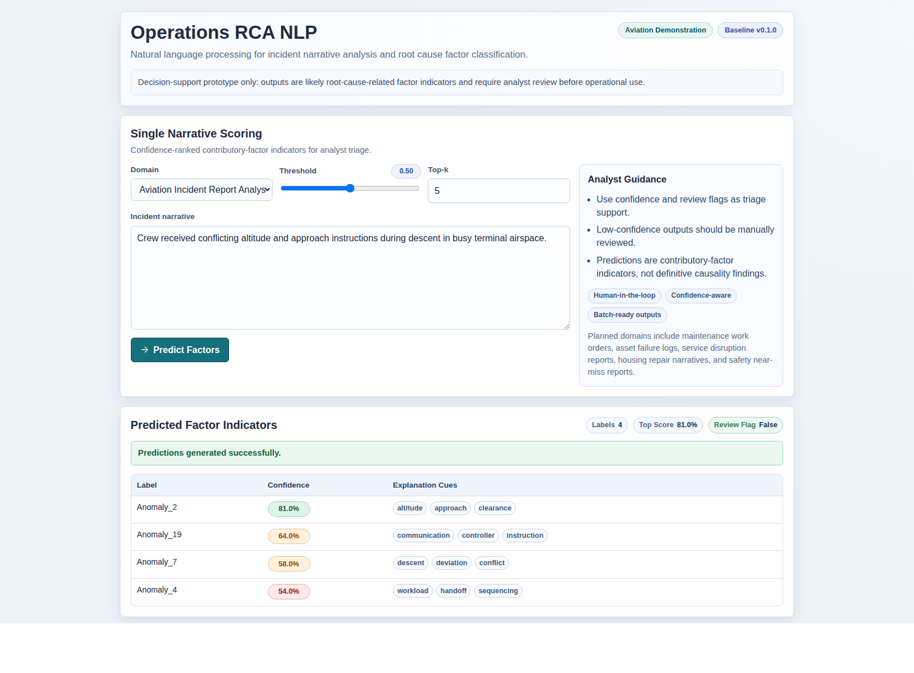
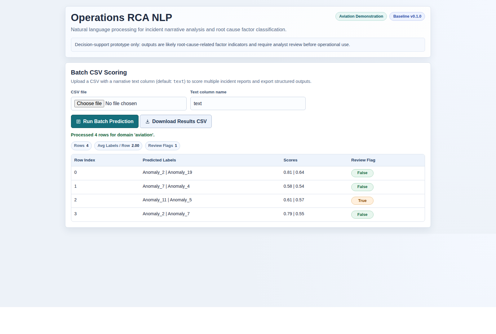
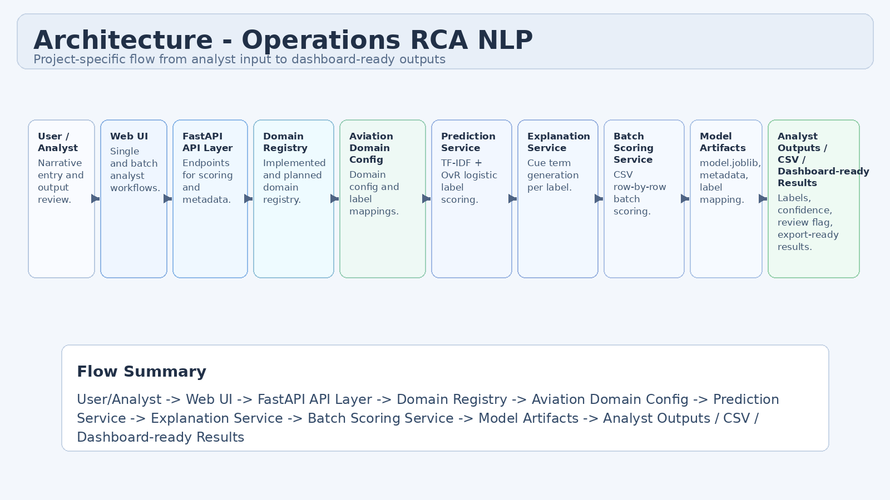
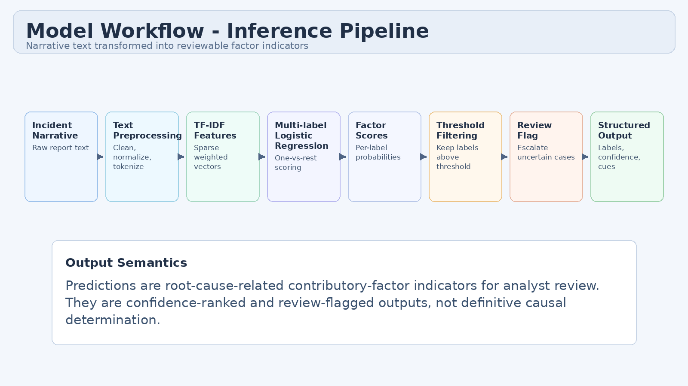
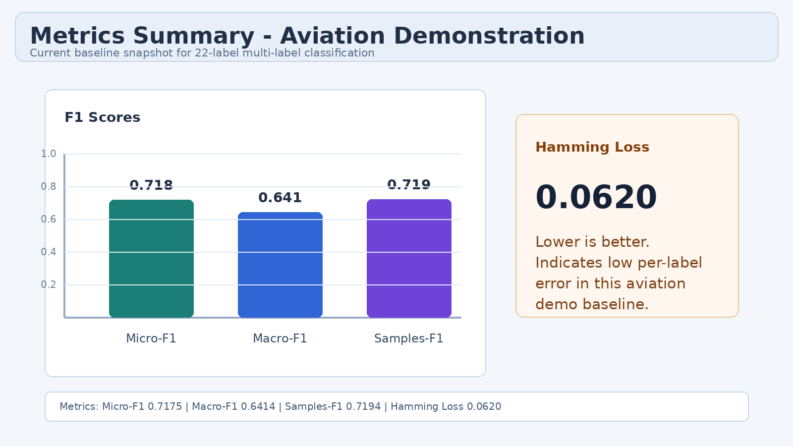

# Operations Root Cause Analytics with NLP

**Natural Language Processing for Incident Narrative Analysis and Root Cause Factor Classification**

Operations RCA NLP is an operations intelligence NLP project for root-cause-related factor classification and analyst review support from free-text incident narratives.

Short name: **Operations RCA NLP**  
Repository: **operations-root-cause-analytics-nlp**

## Live Demo

Try the live app here: [Operations RCA NLP Demo](https://operations-root-cause-analytics-nlp.onrender.com/)

> This demo supports root-cause-related factor classification for analyst review. It does not establish definitive causality or replace expert investigation.
>
> The live demo loads the trained aviation model artifact from Hugging Face using `MODEL_ARTIFACT_URL`, keeping the GitHub repository lightweight and free from model binaries.

## Demo Preview

### Home View

| Dark Theme | Light Theme |
|---|---|
|  |  |

The interface supports light and dark themes for readability during analysis workflows.

### Prediction Results

| Dark Theme | Light Theme |
|---|---|
|  |  |

### Batch Scoring View



Additional batch screenshot variants are listed in [docs/visuals.md](docs/visuals.md).

Visual asset notes and replacement instructions: [docs/visuals.md](docs/visuals.md)

## Project Background

Operations teams generate high volumes of free-text incident narratives across safety logs, maintenance events, disruption reports, and near-miss records. These narratives contain contributory-factor indicators, but manual review is hard to scale consistently. This project converts narrative text into structured outputs for analyst review support and downstream operations intelligence workflows.

## Why This Matters

- Faster triage for analyst teams handling large incident queues
- Better detection of recurring contributory-factor patterns
- More consistent categorization across reviewers and time periods
- Dashboard-ready outputs for operational reporting and action tracking
- Practical support for root-cause-related analysis workflows

## Evidence-Backed Motivation

- NASA's Aviation Safety Reporting System (ASRS) has collected and analyzed over 2 million safety reports since 1976, showing the scale and value of narrative safety data. [1]
- ASRS submissions include unsafe occurrences, near-misses, hazardous situations, and best-practice observations, making aviation a strong first demonstration domain. [1][2]
- OSHA incident-investigation guidance emphasizes finding and correcting underlying causes to prevent recurrence. [3]
- FAA SMS guidance describes hazard identification, risk assessment, risk analysis, and risk control as core safety risk management activities. [4]
- NIST AI RMF 1.0 highlights role clarity and governance when AI outputs support human decision workflows. [5]

## What the System Does

- Accepts free-text incident narratives
- Applies text preprocessing and TF-IDF vectorisation
- Predicts multi-label root-cause-related factor categories
- Returns confidence scores, explanation cues, and evidence-term contributions
- Applies threshold filtering and analyst review flags
- Supports both single narrative scoring and CSV batch scoring
- Exposes outputs through FastAPI endpoints and a lightweight web UI
- Includes light/dark/system theme support in the analyst UI
- Shows model artifact availability status in the UI on load
- Provides Simple View and Analyst View for mixed technical audiences

Current positioning:

- ASRS aviation incident reports are the first implemented demonstration domain
- The platform is not aviation-only and is designed for multi-domain onboarding
- The MVP is text-based now
- The architecture is multi-domain-ready
- The roadmap is multimodal-ready later
- Agentic analyst-support workflows are planned as a future direction

## System Architecture Diagram


_Project-specific architecture from user input to analyst outputs and dashboard-ready results._

## Model Workflow Diagram


_Inference workflow from incident narrative through preprocessing, classification, filtering, and structured output._

## Explainable Predictions

The explainability layer is designed for linear TF-IDF + One-vs-Rest Logistic Regression models.

- For each predicted label, the app computes term contribution scores using:
  - `contribution = tfidf_value * class_coefficient`
- Positive contribution terms are ranked and returned as evidence terms.
- Evidence terms are matched back to narrative spans where possible and highlighted in the UI.
- The UI exposes:
  - Simple View: plain-language interpretation for analyst review support
  - Analyst View: label IDs, technical interpretation, contribution scores, and alternatives
- If coefficient extraction is unavailable for a model structure, the app falls back to token-match explanation cues.

This method provides transparent, auditable indicators for analyst review support. It does not establish definitive causality.

Detailed method notes: [docs/explainability.md](docs/explainability.md)

## Results Summary


_Aviation demonstration metrics overview._

| Metric | Value |
|---|---:|
| Micro-F1 | 0.658 |
| Macro-F1 | 0.630 |
| Samples-F1 | 0.654 |
| Hamming Loss | 0.073 |

Notes:

- Metrics are from the aviation demonstration domain baseline.
- New domains require domain-specific retraining and validation.
- Detailed context: [docs/model_card_aviation.md](docs/model_card_aviation.md)

## Example Output

```json
{
  "status": "ok",
  "input_text": "Crew received conflicting altitude and approach instructions during descent.",
  "domain": "aviation",
  "model_info": {
    "model_name": "TF-IDF + One-vs-Rest Logistic Regression",
    "threshold_used": 0.5,
    "artifact_status": "available",
    "training_approach": "TF-IDF vectorization with One-vs-Rest Logistic Regression",
    "explanation_method": "tfidf_linear_contribution"
  },
  "summary": {
    "predicted_count": 2,
    "top_label_id": "Anomaly_2",
    "top_label_name": "Draft Altitude or Flight Path Deviation Indicator",
    "top_score": 0.81,
    "top_score_percent": 81.0,
    "review_flag": false,
    "review_message": "Predictions generated successfully."
  },
  "predicted_labels": [
    {
      "label": "Anomaly_2",
      "label_id": "Anomaly_2",
      "label_name": "Draft Altitude or Flight Path Deviation Indicator",
      "short_name": "Altitude Path",
      "score": 0.81,
      "score_percent": 81.0,
      "plain_language_description": "Signals wording related to altitude assignment or flight path deviation risk.",
      "technical_description": "Draft label tied to terms around descent, climb, altitude, and path control in the vector space.",
      "operational_interpretation": "Prioritize review of altitude clearances, vertical profile, and correction timeline.",
      "review_guidance": "Validate against ATC clearances, FMS settings, and deviation records.",
      "evidence_terms": [
        {
          "term": "altitude",
          "display_term": "altitude",
          "contribution": 0.2145,
          "importance": "high"
        }
      ],
      "evidence_spans": [
        {
          "term": "altitude",
          "start": 24,
          "end": 32,
          "importance": "high"
        }
      ],
      "explanation_terms": ["altitude", "approach", "clearance"],
      "explanation_method": "tfidf_linear_contribution"
    },
    {
      "label": "Anomaly_19",
      "label_id": "Anomaly_19",
      "label_name": "Draft Separation or Conflict Management Indicator",
      "short_name": "Separation Conflict",
      "score": 0.64,
      "score_percent": 64.0,
      "explanation_terms": ["communication", "controller", "instruction"]
    }
  ],
  "top_scores": [
    {
      "label_id": "Anomaly_2",
      "label_name": "Draft Altitude or Flight Path Deviation Indicator",
      "short_name": "Altitude Path",
      "score": 0.81,
      "score_percent": 81.0
    }
  ],
  "messages": [
    "Predictions generated successfully.",
    "Outputs are root-cause-related factor indicators for analyst review support."
  ],
  "threshold_used": 0.5,
  "review_flag": false,
  "message": "Predictions generated successfully."
}
```

The output is a confidence-ranked set of contributory-factor indicators for analyst review support, not definitive causality findings.

## API Endpoints

- `GET /health`
- `GET /domains`
- `GET /model-info`
- `POST /predict`
- `POST /predict-batch`

### cURL Examples

`GET /health`
```bash
curl -X GET "http://127.0.0.1:8000/health"
```

`GET /domains`
```bash
curl -X GET "http://127.0.0.1:8000/domains"
```

`GET /model-info`
```bash
curl -X GET "http://127.0.0.1:8000/model-info"
```

`POST /predict`
```bash
curl -X POST "http://127.0.0.1:8000/predict" \
  -H "Content-Type: application/json" \
  -d '{
    "text": "Crew received conflicting altitude and approach clearance instructions during descent.",
    "domain": "aviation",
    "threshold": 0.5,
    "top_k": 5
  }'
```

`POST /predict-batch`
```bash
curl -X POST "http://127.0.0.1:8000/predict-batch" \
  -F "file=@sample_inputs/aviation_batch_reports.csv" \
  -F "domain=aviation" \
  -F "threshold=0.5" \
  -F "top_k=5" \
  -F "text_column=text"
```

## Local Setup

```bash
python3 -m venv .venv
source .venv/bin/activate
pip install -r requirements.txt
uvicorn app.main:app --reload
```

Open `http://127.0.0.1:8000` in your browser.

## Artifact Generation

The public repository does not include raw datasets or `model.joblib`. Generate artifacts locally from your permitted dataset copy.

Single-CSV workflow:
```bash
python scripts/train_aviation.py \
  --input-csv <local_labeled_data.csv> \
  --text-column text \
  --output-dir artifacts/aviation

python scripts/evaluate_aviation.py \
  --input-csv <local_labeled_data.csv> \
  --text-column text \
  --artifact-path artifacts/aviation/model.joblib
```

Split-file workflow (`TrainingData.txt` + `TrainCategoryMatrix.csv`):
```bash
python scripts/export_aviation_artifacts.py \
  --train-text data/raw/TrainingData.txt \
  --train-labels data/raw/TrainCategoryMatrix.csv \
  --output-dir artifacts/aviation
```

Copy pre-generated artifacts from another local folder:
```bash
python scripts/export_aviation_artifacts.py \
  --source-dir <artifact_source_dir> \
  --output-dir artifacts/aviation
```

Expected runtime files:

- `artifacts/aviation/model.joblib` (required for live predictions)
- `artifacts/aviation/metadata.json` (recommended)
- `artifacts/aviation/label_mapping.json` (optional)

## Model Artifact Handling

`model.joblib` is intentionally not committed to this public repository.

For deployment environments (including Render), you can provide an external artifact URL through:

- `MODEL_ARTIFACT_URL`
- `MODEL_ARTIFACT_PATH` (optional, defaults to `artifacts/aviation/model.joblib`)

Behavior:

- If `artifacts/aviation/model.joblib` already exists, the app uses it directly.
- If it is missing and `MODEL_ARTIFACT_URL` is set, the app attempts to download the artifact to `artifacts/aviation/model.joblib` on first model load.
- If download fails, the app remains available (`/health`, `/domains`, `/model-info`, UI), and prediction endpoints continue to return model-unavailable messaging until the artifact is available.
- Raw data remains excluded from this repository (`data/raw`, `data/interim`, `data/processed` are not committed).

### Render Deployment Notes

Set these environment variables in Render:

- `PYTHON_VERSION=3.11.9`
- `MODEL_ARTIFACT_URL=<https URL to your model.joblib>`
- `MODEL_ARTIFACT_PATH=artifacts/aviation/model.joblib` (optional override)

## Docker

```bash
docker build -t operations-root-cause-analytics-nlp .
docker run -p 8000:8000 operations-root-cause-analytics-nlp
```

## Responsible Use

- Decision-support system for analyst review workflows
- Not a source of definitive causality findings
- Not a replacement for expert investigation workflows
- Human review remains required
- Not certified as a production safety-critical decision system

## Roadmap

Public roadmap: [docs/roadmap.md](docs/roadmap.md)
Model-improvement roadmap: [docs/model_roadmap.md](docs/model_roadmap.md)

- `v0.1.0` ASRS text-based MVP
- `v0.2.0` explainable analyst interface
- `v0.3.0` full dataset retraining + probability calibration
- `v0.4.0` transformer baseline + sentence-transformer benchmark + SHAP/LIME comparison
- `v0.5.0` zero-shot/weak supervision expansion + similar-case retrieval + analyst feedback loop
- `v0.6.0` multimodal extension + agentic analyst-support workflows

Domain onboarding guide: [docs/adding_new_domain.md](docs/adding_new_domain.md)

## Analytics Industry Relevance

This pattern supports operations intelligence teams that rely on unstructured text but need structured outputs for triage, reporting, and action tracking. It is relevant to aviation, transport, facilities, utilities, housing operations, manufacturing, and service operations where incident narratives are operationally significant.

## References

1. NASA. *Aviation Safety Reporting System (ASRS) Overview*.  
   https://www.nasa.gov/human-systems-integration-division/aviation-safety-reporting-system-overview/
2. NASA ASRS. *Database Overview*.  
   https://asrs.arc.nasa.gov/search/database.html
3. OSHA. *Incident Investigation*.  
   https://www.osha.gov/incident-investigation
4. FAA. *Safety Management System (SMS) Components*.  
   https://www.faa.gov/about/initiatives/sms/explained/components
5. NIST. *AI Risk Management Framework (AI RMF 1.0)*.  
   https://nvlpubs.nist.gov/nistpubs/ai/nist.ai.100-1.pdf
