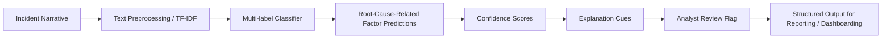

# Operations Root Cause Analytics with NLP

**Natural Language Processing for Incident Narrative Analysis and Root Cause Factor Classification**

An applied operations analytics NLP project that analyzes incident reports and classifies them into likely root-cause-related factor categories to support analyst review and operational decision-making.

Current release framing: text-based MVP now, multi-domain-ready architecture, multimodal-ready expansion later, and agentic analyst-support workflows as a future direction.

Short name: **Operations RCA NLP**  
Repository: **operations-root-cause-analytics-nlp**

## Demo Preview


_Caption: Real screenshot of the running analyst UI home view with domain selection, threshold/top-k controls, and narrative input._


_Caption: Real app prediction-result state showing predicted factor labels, confidence scores, explanation cues, and review-flag messaging._


_Caption: Real app batch-scoring state showing CSV upload controls, run/download actions, and structured multi-row output preview._


_Caption: System architecture showing UI, FastAPI API layer, domain registry, aviation artifacts, prediction/explanation services, batch scorer, and analyst-ready outputs._


_Caption: Narrative-to-signal workflow from preprocessing and TF-IDF through multi-label classification, thresholding, and review-flag output._


_Caption: Current aviation demonstration performance summary (Micro-F1, Macro-F1, Samples-F1, and Hamming Loss)._

Visual asset notes and replacement instructions: [docs/visuals.md](docs/visuals.md)

## Project Background

Operational organizations generate large volumes of free-text reports across incident reporting, maintenance notes, safety observations, service disruption logs, asset failure records, near-miss reports, and housing repair narratives.

These narratives often contain signals about recurring failures, operational risk patterns, process weaknesses, and contributory factors. The challenge is that unstructured text is difficult to review consistently at scale. This project applies NLP to convert raw narrative text into structured, reviewable operations intelligence outputs.

## Why This Project Matters

- Faster incident triage for analysts handling large queues
- Better recurring-issue detection across narrative streams
- More consistent factor categorization across teams
- Structured outputs that are dashboard-ready and audit-friendly
- Practical support for analyst review workflows
- Practical support for root cause analysis workflows
- Better operational risk and reliability intelligence inputs

## Evidence-Backed Real-World Motivation

- NASA’s Aviation Safety Reporting System (ASRS) has collected and analyzed more than 2 million reports since 1976, showing the real scale of incident-narrative operations data. [1][2]
- ASRS submissions include unsafe occurrences, near-misses, hazardous situations, and best-practice observations from aviation operations. [1][2]
- ASRS narratives are de-identified and used for policy work, human factors research, education, training, and safety analysis, which makes them a credible demonstration source for narrative analytics. [1][2]
- OSHA incident-investigation guidance emphasizes that addressing underlying/root causes is necessary to understand incidents, define effective corrective actions, and prevent recurrence. [3]
- FAA Safety Management System (SMS) guidance includes hazard identification, risk assessment, risk analysis, and risk control as core safety risk management steps. [4]
- NIST AI RMF 1.0 emphasizes clearly defined organizational roles and responsibilities when AI supports decision or oversight contexts. [5]

## Current Demonstration Domain

The first implemented demonstration domain is aviation incident narratives from an ASRS/SIAM benchmark snapshot.

Aviation is used as the first domain because it is a mature real-world reporting environment with long-standing safety narrative practices and published governance context. The platform architecture is intentionally designed for broader operations analytics domains beyond aviation.

## What the System Does

- Accepts a free-text incident narrative
- Vectorizes text with TF-IDF
- Predicts multiple root-cause-related factor labels
- Returns confidence scores by label
- Surfaces explanation cue terms
- Flags uncertain cases for analyst review
- Supports single-report and batch CSV scoring
- Exposes outputs through FastAPI and a lightweight web UI

## System Workflow



## Features

- FastAPI backend
- Lightweight interactive web UI
- Single-report prediction
- Batch CSV scoring
- Threshold control
- Top-k control
- Model metadata endpoint
- Explainability-lite cues
- Analyst review flags
- Docker support
- `pytest` test suite
- GitHub Actions CI
- Responsible-use documentation

## Model Summary (Aviation Demonstration)

- Model: TF-IDF + One-vs-Rest Logistic Regression
- Labels: 22 (`Anomaly_1` to `Anomaly_22`)
- Default threshold: `0.50`
- Evaluation metrics:
  - Micro-F1: `0.658`
  - Macro-F1: `0.630`
  - Samples-F1: `0.654`
  - Hamming Loss: `0.073`

## Results

| Metric | Value |
|---|---:|
| Micro-F1 | 0.658 |
| Macro-F1 | 0.630 |
| Samples-F1 | 0.654 |
| Hamming Loss | 0.073 |

Interpretation:
- Micro-F1 and Samples-F1 indicate useful overall multi-label performance for analyst-support triage.
- Macro-F1 shows more variability across labels, which is expected in imbalanced operational taxonomies.
- Hamming Loss indicates relatively low per-label error for this demonstration setup.

Notes:
- These values are from the aviation demonstration domain only.
- New domains require domain-specific retraining and revalidation.
- Detailed model context: [docs/model_card_aviation.md](docs/model_card_aviation.md)

## Example Output

```json
{
  "input_text": "Crew received conflicting altitude and approach instructions during descent.",
  "domain": "aviation",
  "predicted_labels": [
    {
      "label": "Anomaly_2",
      "score": 0.81,
      "explanation_terms": ["altitude", "approach", "clearance"]
    },
    {
      "label": "Anomaly_19",
      "score": 0.64,
      "explanation_terms": ["communication", "controller", "instruction"]
    }
  ],
  "threshold_used": 0.5,
  "review_flag": false,
  "message": "Predictions generated successfully."
}
```

Human-readable interpretation:
- The narrative likely maps to two contributory-factor categories with moderate-to-strong confidence.
- Explanation cues show the lexical evidence influencing label ranking.
- `review_flag` communicates whether manual analyst attention should be prioritized.

## API Endpoints

- `GET /health`
- `GET /domains`
- `GET /model-info`
- `POST /predict`
- `POST /predict-batch`

### cURL Examples

`GET /health`
```bash
curl -X GET "http://127.0.0.1:8000/health"
```

`GET /domains`
```bash
curl -X GET "http://127.0.0.1:8000/domains"
```

`GET /model-info`
```bash
curl -X GET "http://127.0.0.1:8000/model-info"
```

`POST /predict`
```bash
curl -X POST "http://127.0.0.1:8000/predict" \
  -H "Content-Type: application/json" \
  -d '{
    "text": "Crew received conflicting altitude and approach clearance instructions during descent.",
    "domain": "aviation",
    "threshold": 0.5,
    "top_k": 5
  }'
```

`POST /predict-batch`
```bash
curl -X POST "http://127.0.0.1:8000/predict-batch" \
  -F "file=@sample_inputs/aviation_batch_reports.csv" \
  -F "domain=aviation" \
  -F "threshold=0.5" \
  -F "top_k=5" \
  -F "text_column=text"
```

## How to Run Locally

```bash
python3 -m venv .venv
source .venv/bin/activate
pip install -r requirements.txt
uvicorn app.main:app --reload
```

Open `http://127.0.0.1:8000` in your browser.

## How to Generate Artifacts

The public repository does not include raw datasets or `model.joblib`. Generate artifacts locally from your permitted dataset copy.

Single-CSV workflow:
```bash
python scripts/train_aviation.py \
  --input-csv <local_labeled_data.csv> \
  --text-column text \
  --output-dir artifacts/aviation

python scripts/evaluate_aviation.py \
  --input-csv <local_labeled_data.csv> \
  --text-column text \
  --artifact-path artifacts/aviation/model.joblib
```

Split-file workflow (`TrainingData.txt` + `TrainCategoryMatrix.csv`):
```bash
python scripts/export_aviation_artifacts.py \
  --train-text data/raw/TrainingData.txt \
  --train-labels data/raw/TrainCategoryMatrix.csv \
  --output-dir artifacts/aviation
```

Copy pre-generated artifacts from another local folder:
```bash
python scripts/export_aviation_artifacts.py \
  --source-dir <artifact_source_dir> \
  --output-dir artifacts/aviation
```

Expected runtime files:
- `artifacts/aviation/model.joblib` (required)
- `artifacts/aviation/metadata.json` (recommended)
- `artifacts/aviation/label_mapping.json` (optional)

`metadata.json` includes model details, threshold, label count, training date, training approach, evaluation metrics, dataset provenance, limitation framing, and responsible-use guidance.

## Docker

```bash
docker build -t operations-root-cause-analytics-nlp .
docker run -p 8000:8000 operations-root-cause-analytics-nlp
```

## Responsible Use

- Decision support only
- Not definitive root cause determination
- Not causal proof
- Not a replacement for expert investigation
- Human review required
- Not certified for operational safety decisions

## Future Roadmap

Versioned public roadmap: [docs/roadmap.md](docs/roadmap.md)

- `v0.1.0` ASRS text-based MVP
- `v0.2.0` analytics/dashboard layer
- `v0.3.0` multi-domain expansion
- `v0.4.0` multimodal-ready expansion
- `v0.5.0` agentic analyst-support workflows

Domain onboarding guide: [docs/adding_new_domain.md](docs/adding_new_domain.md)

## Analytics Industry Relevance

Many analytics teams work with unstructured operational text but still need structured outputs for dashboards, triage workflows, reporting, RCA support, and action prioritization.

This pattern is relevant to asset management, facilities management, transport, utilities, housing, manufacturing, safety operations, and service operations where narrative text is operationally important but difficult to scale manually.

## References

1. NASA. *Aviation Safety Reporting System (ASRS) Overview*.  
   https://www.nasa.gov/human-systems-integration-division/aviation-safety-reporting-system-overview/
2. NASA ASRS. *Database Overview*.  
   https://asrs.arc.nasa.gov/search/database.html
3. OSHA. *Incident Investigation*.  
   https://www.osha.gov/incident-investigation
4. FAA. *Safety Management System (SMS) Components*.  
   https://www.faa.gov/about/initiatives/sms/explained/components
5. NIST. *AI Risk Management Framework (AI RMF 1.0)*.  
   https://nvlpubs.nist.gov/nistpubs/ai/nist.ai.100-1.pdf
